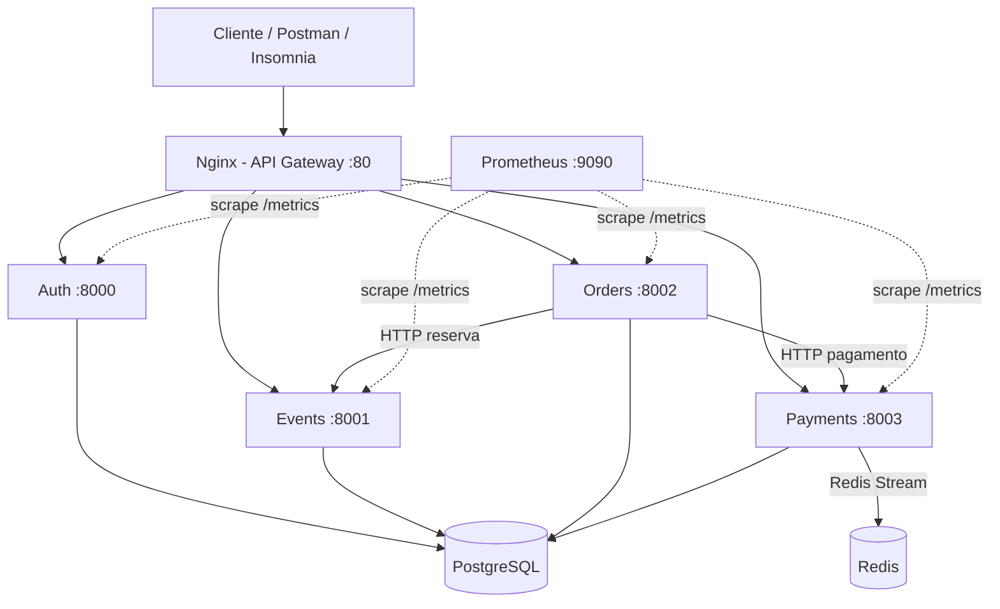
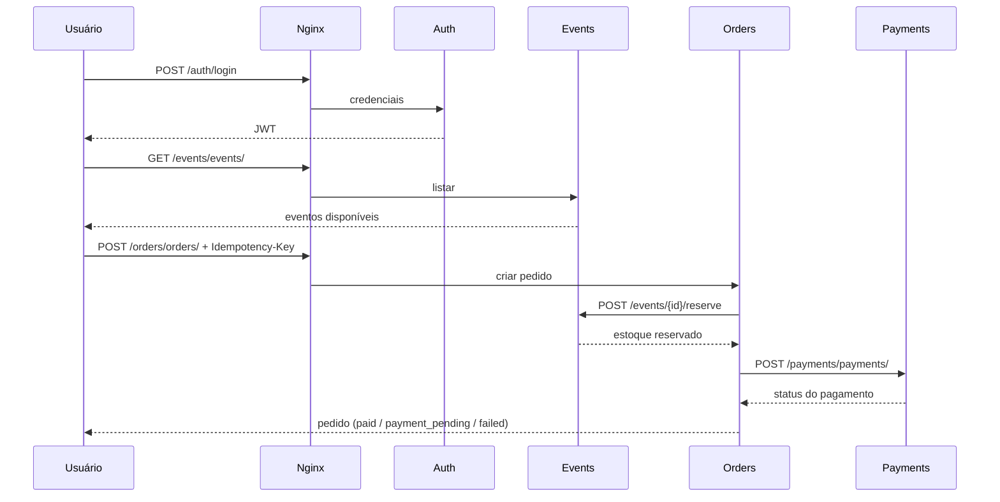

# Relatório Final — Ingressos Online

**Disciplina:** Sistemas Distribuídos (A3)  
**Projeto:** Plataforma de venda de ingressos baseada em microsserviços  
**Data:** Junho/2026

---

## 1. Introdução

Este documento descreve o sistema **Ingressos Online**, uma aplicação distribuída para cadastro de eventos, compra de ingressos e processamento de pagamentos. A solução foi construída com arquitetura de microsserviços, orquestrada via Docker Compose, com um API Gateway (Nginx) como ponto de entrada único.

O objetivo do projeto é demonstrar conceitos de sistemas distribuídos: desacoplamento de serviços, comunicação síncrona entre APIs, isolamento de bancos de dados, idempotência, autenticação distribuída (JWT), balanceamento de carga, mensageria assíncrona e observabilidade.

---

## 2. Objetivos

- Permitir que administradores cadastrem e gerenciem eventos (preço e estoque).
- Permitir que usuários autenticados comprem ingressos com controle de estoque.
- Simular pagamentos (Pix, Boleto, Cartão) com diferentes resultados.
- Garantir resiliência parcial com chaves de idempotência em operações críticas.
- Expor métricas para monitoramento via Prometheus.
- Disponibilizar a API de forma unificada através de um gateway HTTP.

---

## 3. Arquitetura do Sistema



### 3.1 Componentes

| Componente | Tecnologia | Responsabilidade |
|---|---|---|
| API Gateway | Nginx | Roteamento, proxy reverso e health do gateway |
| Auth | FastAPI + PostgreSQL | Cadastro, login e JWT |
| Events | FastAPI + PostgreSQL | CRUD de eventos, estoque e reservas |
| Orders | FastAPI + PostgreSQL | Orquestração da compra |
| Payments | FastAPI + PostgreSQL + Redis | Simulação de pagamento e notificação |
| Banco de dados | PostgreSQL 15 | Um banco por serviço (`auth_db`, `events_db`, `orders_db`, `payments_db`) |
| Mensageria | Redis 7 (Streams) | Publicação de eventos de pagamento |
| Monitoramento | Prometheus | Coleta de métricas HTTP dos microsserviços |

O FastAPI foi escolhido por permitir desenvolvimento rápido de APIs tipadas com Pydantic, documentação automática e alto desempenho em Python. O Redis Streams foi usado para a mensageria assíncrona de pagamentos, entregando persistência de eventos, consumo ordenado e desacoplamento entre serviços. Uma biblioteca de retries foi adotada nas chamadas HTTP inter-serviços para reduzir falhas temporárias de rede e aumentar a robustez do sistema.

### 3.2 Escalabilidade

Cada microsserviço principal está configurado com **2 réplicas** no `docker-compose.yml`. O Nginx distribui requisições entre as instâncias ativas na rede interna do Docker.

---

## 4. Microsserviços

### 4.1 Auth (Autenticação)

- **Base URL (gateway):** `http://localhost/auth`
- **Banco:** `auth_db`
- **Autenticação:** JWT (Bearer token, expiração configurável)
- **Papéis:** `user` e `admin`

**Endpoints principais:**

| Método | Rota | Descrição | Autenticação |
|---|---|---|---|
| POST | `/auth/register` | Cadastro de usuário | Pública (admin pode criar outro admin) |
| POST | `/auth/login` | Login (form `username` + `password`) | Pública |
| GET | `/auth/me` | Dados do usuário logado | Bearer JWT |
| GET | `/auth/health` | Health check | Pública |

**Regra de segurança:** cadastro público força `role=user`, mesmo que o cliente envie `admin`. Apenas um admin autenticado pode criar outro administrador.

### 4.2 Events (Eventos)

- **Base URL (gateway):** `http://localhost/events`
- **Banco:** `events_db`

**Endpoints principais:**

| Método | Rota | Descrição | Autenticação |
|---|---|---|---|
| POST | `/events/events/` | Criar evento | Admin |
| GET | `/events/events/` | Listar eventos | Pública |
| PATCH | `/events/events/{id}/quantity` | Atualizar estoque | Admin |
| PATCH | `/events/events/{id}/price` | Atualizar preço | Admin |
| POST | `/events/events/{id}/reserve` | Reservar ingressos | Interna (header `Idempotency-Key`) |
| GET | `/events/health` | Health check | Pública |

**Controle de concorrência:** a reserva usa `SELECT ... FOR UPDATE` no PostgreSQL para evitar overselling. Chaves de idempotência impedem débito duplicado de estoque.

### 4.3 Orders (Pedidos)

- **Base URL (gateway):** `http://localhost/orders`
- **Banco:** `orders_db`

**Endpoints principais:**

| Método | Rota | Descrição | Autenticação |
|---|---|---|---|
| POST | `/orders/orders/` | Criar pedido | Bearer JWT + `Idempotency-Key` |
| GET | `/orders/orders/` | Listar pedidos do usuário | Bearer JWT |
| GET | `/orders/orders/{id}` | Detalhe do pedido | Bearer JWT |
| GET | `/orders/health` | Health check | Pública |

**Fluxo interno ao criar pedido:**
1. Persiste o pedido com status `created`.
2. Chama Events para reservar ingressos.
3. Chama Payments para processar pagamento.
4. Atualiza status para `reserved`, `paid`, `payment_pending` ou `failed`.

### 4.4 Payments (Pagamentos)

- **Base URL (gateway):** `http://localhost/payments`
- **Banco:** `payments_db`

**Endpoints principais:**

| Método | Rota | Descrição | Autenticação |
|---|---|---|---|
| POST | `/payments/payments/` | Criar pagamento | Interna |
| GET | `/payments/payments/{id}` | Consultar pagamento | Interna |
| GET | `/payments/health` | Health check | Pública |

**Regras de simulação:**

| Método | Resultado padrão |
|---|---|
| `pix` | `approved` |
| `credit_card` | `approved` |
| `boleto` | `pending` |
| Qualquer + `force_reject: true` | `rejected` |

Após criar o pagamento, um evento é publicado no Redis Stream `payment-events` (ou logado se Redis indisponível).

---

## 5. Fluxo de Compra (Demonstração)



---

## 6. Padrões e Decisões de Projeto

### 6.1 Database per Service

Cada microsserviço possui seu próprio schema/banco no mesmo cluster PostgreSQL, garantindo isolamento lógico e autonomia de evolução.

### 6.2 Idempotência

Operações críticas exigem o header `Idempotency-Key`:
- Reserva de ingressos (Events)
- Criação de pedidos (Orders)

Requisições repetidas com a mesma chave retornam o resultado anterior sem efeitos colaterais duplicados.

### 6.3 API Gateway

O Nginx centraliza o acesso externo na porta 80, simplificando testes e demonstrações. Clientes não precisam conhecer portas internas dos serviços.

### 6.4 Observabilidade

Todos os serviços FastAPI expõem `/metrics` via `prometheus-fastapi-instrumentator`. O Prometheus (porta 9090) descobre réplicas dinamicamente via DNS do Docker.

---

## 7. Infraestrutura e Execução

### 7.1 Pré-requisitos

- Docker Desktop (ou Docker + Docker Compose)
- Postman ou Insomnia (para testes na apresentação)

### 7.2 Configuração de ambiente

Copie os arquivos `.env.example` de cada serviço para `.env`:

```bash
cp auth/.env.example auth/.env
cp events/.env.example events/.env
cp orders/.env.example orders/.env
cp payments/.env.example payments/.env
```

### 7.3 Subir a aplicação

```bash
docker compose up --build -d
docker compose ps
```

### 7.4 Criar usuário administrador

```bash
docker compose exec auth python create_admin.py
```

Credenciais padrão (definidas em `auth/.env.example`):
- E-mail: `admin@ingressos.com`
- Senha: `admin123`

### 7.5 Verificar saúde do sistema

```bash
curl http://localhost/health
curl http://localhost/auth/health
curl http://localhost/events/health
curl http://localhost/orders/health
curl http://localhost/payments/health
```

### 7.6 Monitoramento

Acesse `http://localhost:9090` e verifique os targets dos jobs `auth`, `events`, `orders` e `payments`.

---

## 8. Testes Automatizados

Cada microsserviço possui testes com **pytest**. Exemplos de cobertura:

| Serviço | Cenários testados |
|---|---|
| Auth | Cadastro, login, JWT, permissões admin |
| Events | CRUD, reserva, estoque insuficiente, idempotência |
| Orders | Fluxo completo, idempotência, falha de estoque |
| Payments | Pix aprovado, boleto pendente, rejeição forçada |

Para executar (dentro de cada pasta do serviço):

```bash
poetry install
poetry run pytest
```

---

## 9. Collections para Apresentação (Postman / Insomnia)

As collections estão em `docs/collections/`:

| Arquivo | Uso |
|---|---|
| `ingressos-online.postman_collection.json` | Importar no Postman |
| `ingressos-online-insomnia.json` | Importar no Insomnia |

### 9.1 Como importar no Postman

1. Abra o Postman → **Import** → selecione `ingressos-online.postman_collection.json`.
2. A collection já define a variável `base_url = http://localhost`.
3. Execute as requisições na ordem sugerida pela pasta **"00 - Setup"** e depois **"01 - Fluxo de Apresentação"**.

### 9.2 Como importar no Insomnia

**Opção A (recomendada):** File → Import → selecione o arquivo `.postman_collection.json` (Insomnia importa nativamente).

**Opção B:** Importe diretamente `ingressos-online-insomnia.json`.

### 9.3 Roteiro sugerido para a apresentação (5–10 min)

1. **Health checks** — mostrar que todos os serviços estão no ar.
2. **Login Admin** — obter token (script salva automaticamente em `admin_token`).
3. **Criar evento** — salva `event_id` automaticamente.
4. **Listar eventos** — mostrar evento público sem autenticação.
5. **Cadastrar usuário** — criar comprador.
6. **Login usuário** — salva `user_token`.
7. **Criar pedido (Pix)** — status `paid`, estoque decrementado.
8. **Listar pedidos** — mostrar histórico do usuário.
9. **(Opcional) Pedido com Boleto** — status `payment_pending`.
10. **(Opcional) Idempotência** — repetir pedido com mesma `Idempotency-Key`.

---

## 10. Limitações Conhecidas

- O valor do pagamento usa `quantity` como placeholder (preço real do evento ainda não é consultado na integração).
- Pagamentos e reservas expostos via gateway são rotas internas simuladas para fins acadêmicos.
- Não há frontend; a demonstração é feita via API REST.
- Circuit breaker e retry avançados não foram implementados (possível evolução futura).

---

## 11. Conclusão

O projeto **Ingressos Online** implementa uma arquitetura distribuída funcional com separação clara de responsabilidades, comunicação HTTP entre serviços, isolamento de dados, autenticação centralizada via JWT, controle de concorrência no estoque e observabilidade básica. A infraestrutura containerizada facilita a reprodução do ambiente e a demonstração em sala de aula.

O FastAPI foi escolhido para acelerar o desenvolvimento de APIs REST tipadas com documentação automática e bom desempenho. O uso de Redis Streams garante mensageria assíncrona de pagamentos com eventos persistentes e consumo desacoplado. A adoção de uma biblioteca de retries torna as integrações HTTP entre serviços mais resilientes frente a falhas temporárias de rede.

As collections do Postman/Insomnia permitem executar o fluxo completo de ponta a ponta de forma reproduzível durante a apresentação.

---

## 12. Referências

- FastAPI — https://fastapi.tiangolo.com/
- Docker Compose — https://docs.docker.com/compose/
- Nginx — https://nginx.org/en/docs/
- Prometheus — https://prometheus.io/docs/
- Padrão Idempotency-Key — https://datatracker.ietf.org/doc/html/draft-ietf-httpapi-idempotency-key-header

---

## Anexo A — Integrantes do Grupo

| Nome | RA | Contribuição |
|---|---|---|
| _(preencher)_ | _(preencher)_ | _(preencher)_ |
| _(preencher)_ | _(preencher)_ | _(preencher)_ |

## Anexo B — Endpoints Completos (Gateway)

```
GET    http://localhost/health
GET    http://localhost/auth/health
POST   http://localhost/auth/register
POST   http://localhost/auth/login
GET    http://localhost/auth/me
GET    http://localhost/events/health
POST   http://localhost/events/events/
GET    http://localhost/events/events/
PATCH  http://localhost/events/events/{id}/quantity
PATCH  http://localhost/events/events/{id}/price
POST   http://localhost/events/events/{id}/reserve
GET    http://localhost/orders/health
POST   http://localhost/orders/orders/
GET    http://localhost/orders/orders/
GET    http://localhost/orders/orders/{id}
GET    http://localhost/payments/health
POST   http://localhost/payments/payments/
GET    http://localhost/payments/payments/{id}
```
